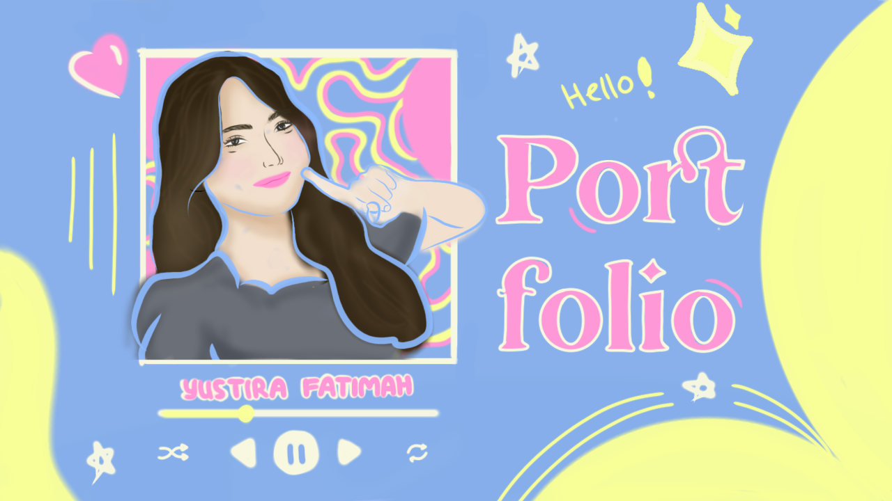

# Hi Guys! I'm Tira👋

  

# 💫 About Me:
## 🌼 hi, i'm yustira ˚₊‧꒰ა♡໒꒱ ‧₊˚  🌸 Love designing clean and chill UI   🎨 Currently exploring UI/UX Design, Flutter, Next.js ☕ fueled by coffee and cozy playlists.   🌱 still learning every day and trying to level up 💪 

## 🌐 Socials:
  

# 💻 Tech Stack:
        
# 📊 GitHub Stats:
 
 

## 🏆 GitHub Trophies

### 🔝 Top Contributed Repo

---

<!-- Proudly created with GPRM ( https://gprm.itsvg.in ) -->

<!--
**quiettira/quiettira** is a ✨ _special_ ✨ repository because its `README.md` (this file) appears on your GitHub profile.

Here are some ideas to get you started:

- 🔭 I’m currently working on ...
- 🌱 I’m currently learning ...
- 👯 I’m looking to collaborate on ...
- 🤔 I’m looking for help with ...
- 💬 Ask me about ...
- 📫 How to reach me: ...
- 😄 Pronouns: ...
- ⚡ Fun fact: ...
-->
